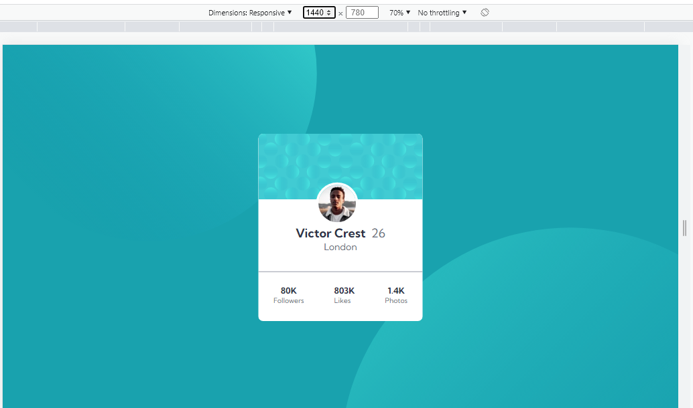
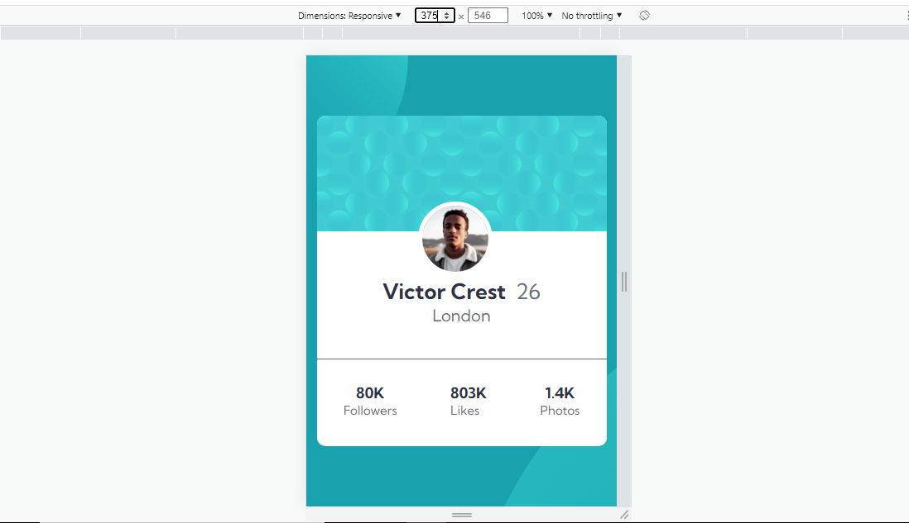

# FrontEndMentorChallenge5
Frontend Mentor | Profile card component

## Table of contents

- [Overview](#overview)
  - [The challenge](#the-challenge)
  - [Screenshot](#screenshot)
  - [Links](#links)
- [My process](#my-process)
  - [Built with](#built-with)
  - [What I learned](#what-i-learned)
- [Author](#author)

**Note: Delete this note and update the table of contents based on what sections you keep.**

## Overview

### The challenge

- Build out the project to the designs provided

### Screenshot

### Links

- Solution URL: [Add solution URL here](https://github.com/arunsingh009/FrontEndMentorChallenge5)
- Live Site URL: [Add live site URL here](https://arunsingh009.github.io/FrontEndMentorChallenge5/)

## My process

### Built with

- Semantic HTML5 markup
- CSS custom properties
- Flexbox
- CSS Grid
- Media Queries

### What I learned

By this task I came to know more about CSS pseudo Selectors such as ::before and ::after

## Author

- Website - [Arun Kumar Singh](https://arunkumarsinghportfolio.netlify.app/)
- Frontend Mentor - [@arunsingh009](https://www.frontendmentor.io/profile/arunsingh009)
- Twitter - [@arunsingh641997](https://www.twitter.com/arunsingh641997)

